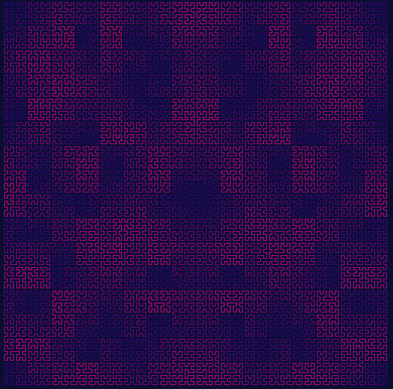

# Hilbert_Curve

* Pequeno programa em java para renderizar a curva de Hilbert até determinado nível. 
* Não recomendado usar em setup de vários monitores.
* Todo o processo de gerar as curvas é feito recursivamente, e o número de curvas cresce
exponencialmente: cada curva gera outras 4. Gerar curvas até níveis muito altos pode provocar
um StackOverFlow. De acordo com testes, esta implementação pode renderizar até o nível 10 em 
uma máquina comum;

* A small java program to render the Hilbert Curve up to a given level.
* Not recommended to use in several monitors setup.
* The entire process of generating curves is calculated by a recursive function, and the number
of curves grows exponentialy: each curve generates 4 other curves. Generating curves up to very
high levels may trigger a StackOverFlow Exception. According to tests, this implementation can 
handle renderizations up to level 10.
